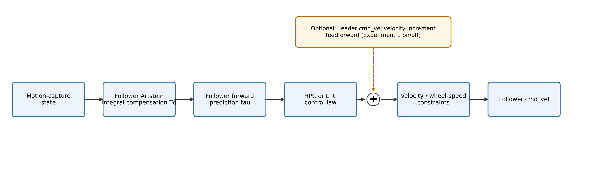
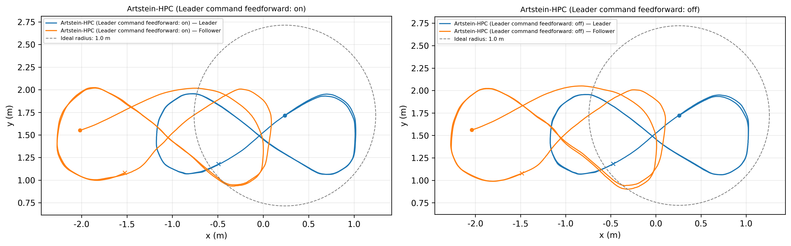
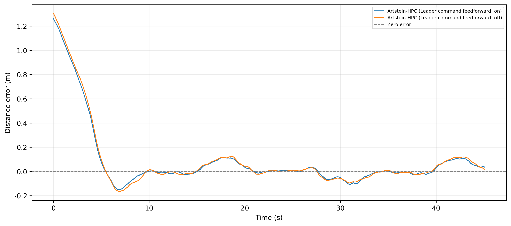
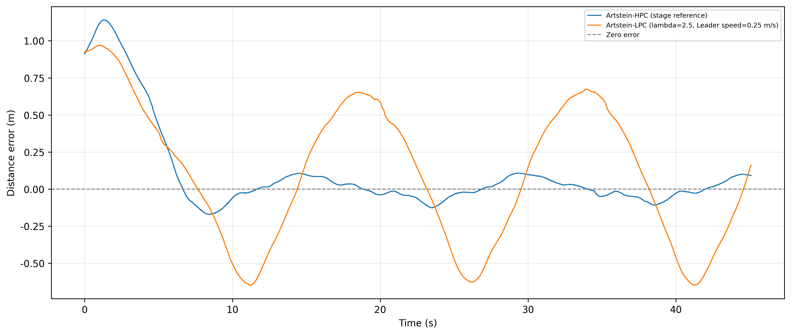

# 双移动机器人 Leader–Follower 实物跟踪实验总结

## 1. 实验任务说明

本实验在双移动机器人 Leader–Follower 场景中，记录并整理 Artstein-HPC 与 Artstein-LPC 的阶段性实物跟踪结果。评价半径固定为 1.0 m，所有统计均以该理想编队半径为唯一评价基准。

## 2. 实物实验平台、数据流与控制方法

两台全向移动机器人采用动捕状态源。Leader 的轨迹由速度命令驱动，Follower 根据相对编队误差输出速度命令。控制频率为 20 Hz，单次有效记录时长约 45 s。

实物全向移动机器人的控制指令从计算到电机实际响应存在纯滞后，其动态响应采用一阶惯性环节近似描述。若直接依据当前测量状态计算控制量，容易产生跟踪滞后。为此，控制器首先通过 Artstein 变换将历史控制输入纳入扩展状态，消除输入纯滞后对控制律的影响；随后依据电机时间常数 `tau` 对 Follower 状态进行前向预测，估计控制指令实际生效时的运动状态。HPC/LPC 基于该预测状态计算跟踪控制量，再经速度与轮速约束后发送至机器人。

为减小 Leader 速度变化时仅依赖位姿反馈带来的响应滞后，控制器可订阅 Leader 的 `cmd_vel`，提取相邻命令之间的速度增量并经低通处理后叠加到 Follower 的控制输出。当命令数据超时，前馈增量不再参与控制。本实验通过开启和关闭该前馈机制，考察其对实物跟踪误差与响应过程的影响。

*图 1　实物跟踪控制与数据流*

## 3. 实验过程与统一条件

四组有效记录均来自实物平台和动捕状态源，并采用统一的轨迹记录方式，保存 Leader 与 Follower 的位置、速度及相对距离等时序数据。每组实验结束后均保存原始轨迹数据和参数快照，作为后续误差统计、图表绘制和对比分析的依据。

实物实验中，Leader 与 Follower 分别运行在 `/robot1` 和 `/robot2` 命名空间下，采用动捕以 120 Hz 提供状态反馈，控制频率设置为 20 Hz。

控制器的延迟补偿模型中，输入纯滞后取 `Td=0.22 s`，执行器动态响应采用时间常数 `tau=0.43 s` 的一阶惯性环节近似描述，并据此进行 Artstein 补偿和 Follower 状态前向预测。

每次实验前，先完成两台机器人的初始状态设置、动捕状态确认和控制参数检查；在 Leader 按设定轨迹运动、Follower 进入闭环跟踪后，连续记录 45 s 的状态与运动数据。实验结束后停止两台机器人运动，并对采集结果进行完整性检查后用于后续分析。

<!-- 表 1：实验条件表，数据：experiment-conditions.csv -->

### 数据来源对照

图表中的来源代号与原始数据对应如下：

| 来源 | 实验标签 | 原始目录 / trial-ID |
| --- | --- | --- |
| A | Artstein-HPC（Leader 命令前馈：开） | `robot_traj/real/4d_artstein_forward_8traj_20260914_204226 / trial_02` |
| B | Artstein-HPC（Leader 命令前馈：关） | `robot_traj/real/4d_artstein_no_forward_8traj_20260914_204546 / trial_01` |
| C | Artstein-LPC（λ初值=2.0，Leader 速度=0.20 m/s） | `robot_traj/real/4d_artstein_lpc_20260915_104805 / trial_01` |
| D | Artstein-LPC（λ初值=2.5，Leader 速度=0.25 m/s） | `robot_traj/real/4d_artstein_lpc_20260915_105440 / trial_02` |

## 4. 实验一：Artstein-HPC 的 Leader 命令速度前馈开/关对比

在两组约 45 s、Leader 平均速度约 0.246 m/s 的 Artstein-HPC 实测记录中，开启 Leader 命令速度前馈的平均绝对距离误差为 0.1202 m、RMS 距离误差为 0.2791 m；关闭时分别为 0.1282 m 和 0.2895 m。开启组在这两个汇总指标上较低。

末帧绝对距离误差则为 0.0355 m，高于关闭组的 0.0165 m。因此该组对比仅描述已记录的实测差异，不将其概括为所有指标的一致改善。

*图 2　Artstein-HPC 前馈开关轨迹对比（来源 A、B）*

*图 3　Artstein-HPC 前馈开关距离误差（来源 A、B）*

<!-- 表 2：前馈开/关指标表，数据：metrics.csv，筛选：leader_command_feedforward -->

## 5. 实验二：Artstein-HPC 与 Artstein-LPC 的阶段性结果

LPC 两条有效记录的平均绝对距离误差分别为 0.4001 m 与 0.4144 m，RMS 距离误差分别为 0.4547 m 与 0.4771 m。对应的 `initial_min_lambda` 与 Leader 速度同时变化，结果只作为阶段性观察。

LPC 在 `initial_min_lambda=1.5`、Leader 速度 0.25 m/s 的实物工况下发生碰撞，未形成可用于轨迹统计的有效记录。LPC 的 λ初值=2.0 记录同时将 Leader 速度降至 0.20 m/s；λ初值=2.5 记录使用 0.25 m/s。因此现有 HPC/LPC 结果用于说明阶段性可运行性和现象，不用于宣称严格单变量条件下的性能优劣。

*图 4　Artstein-HPC 与 Artstein-LPC 阶段性轨迹（来源 A、C、D）*

*图 5　Artstein-HPC 与 Artstein-LPC 阶段性距离误差（来源 A、C、D）*

<!-- 表 3：HPC/LPC 阶段性指标表，数据：metrics.csv，筛选：hpc_lpc_stage_result -->

## 6. 阶段性成果、当前问题与下一步工作

已形成统一的实物实验条件表、1.0 m 基准指标表和可复核的图表总结。下一步应在固定 Leader 速度、初始 λ 和其他运行条件后，补充可重复试验；同时继续核对前馈支路标注与原始实验配置的一致性。
