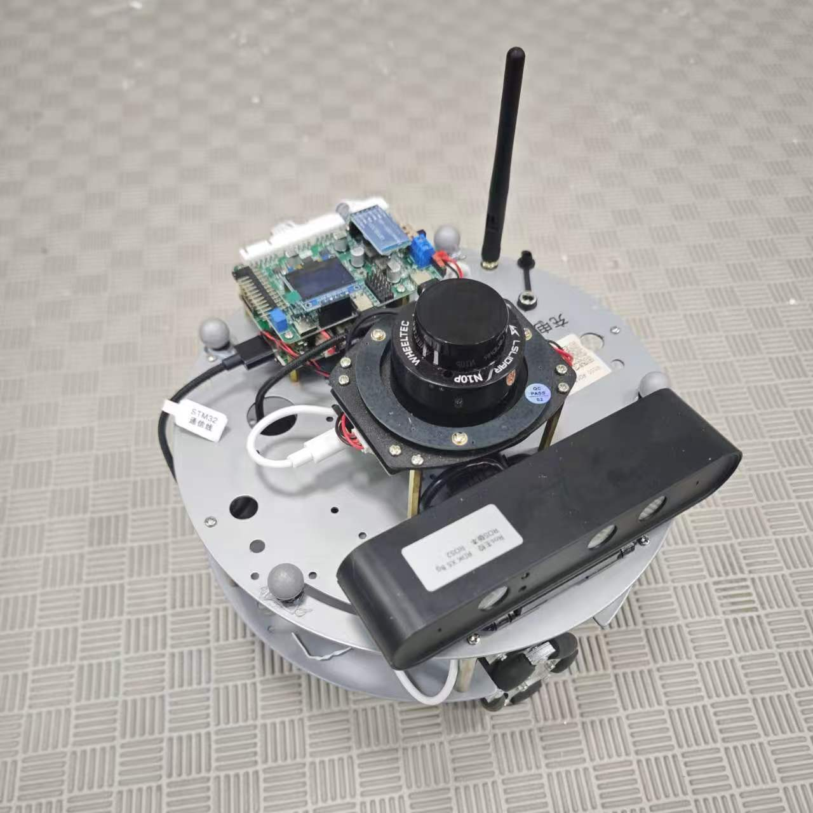
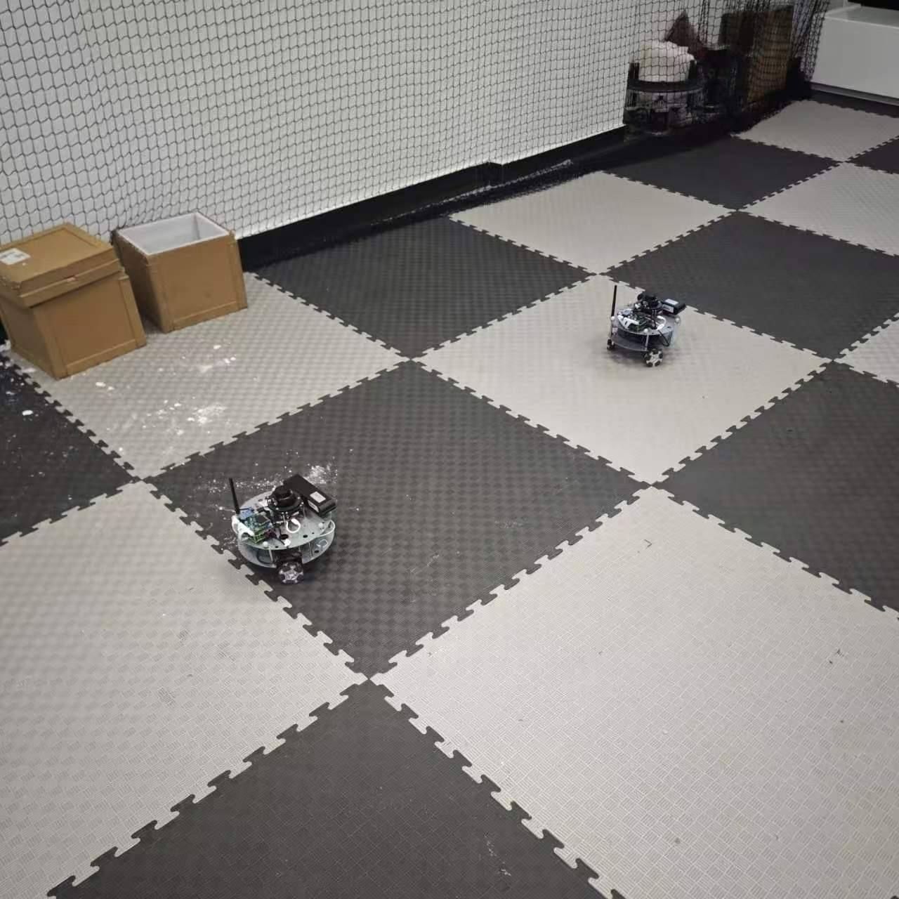
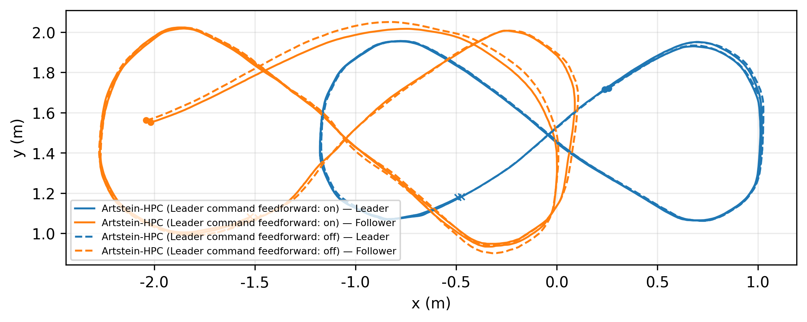
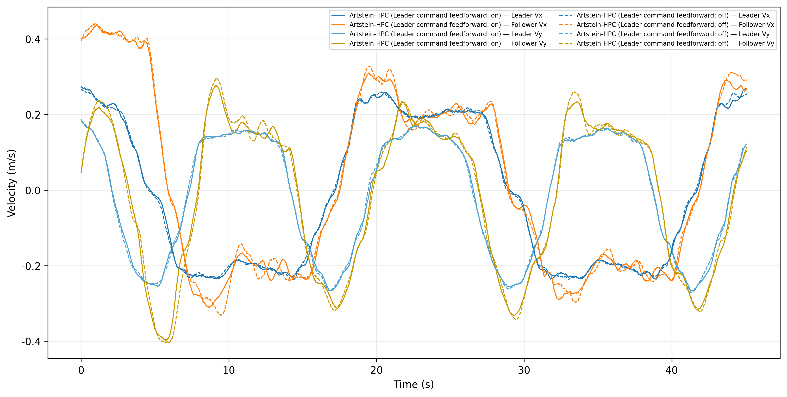
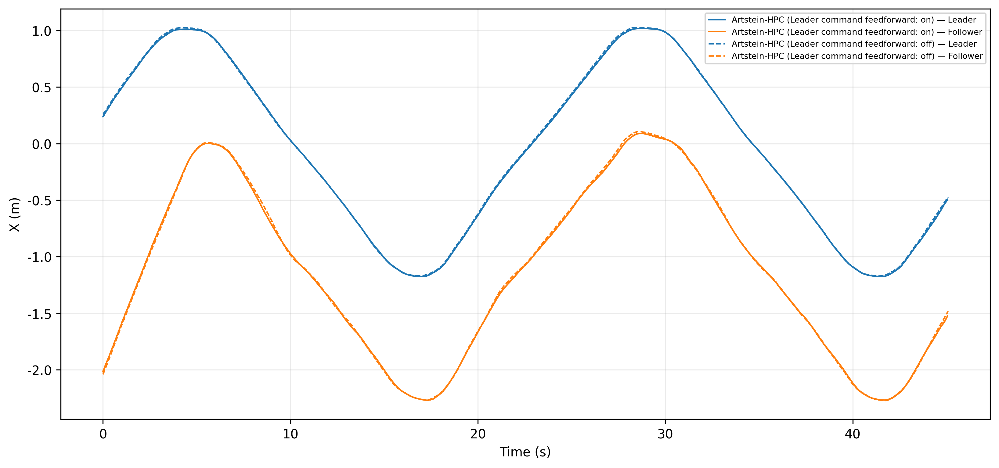
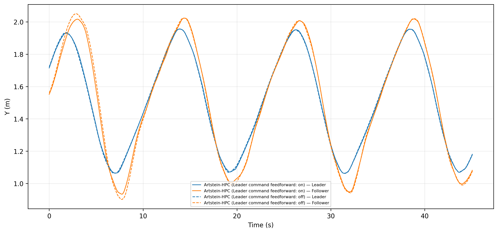
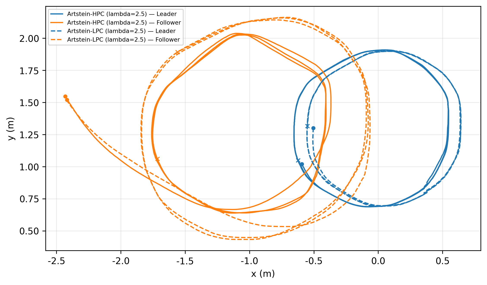
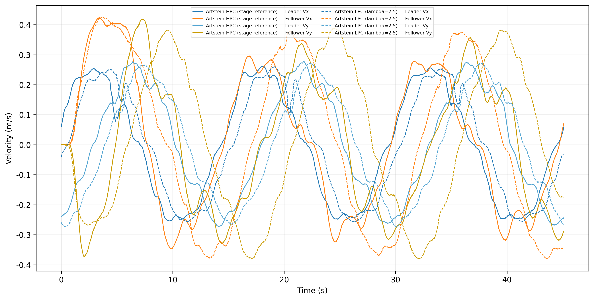
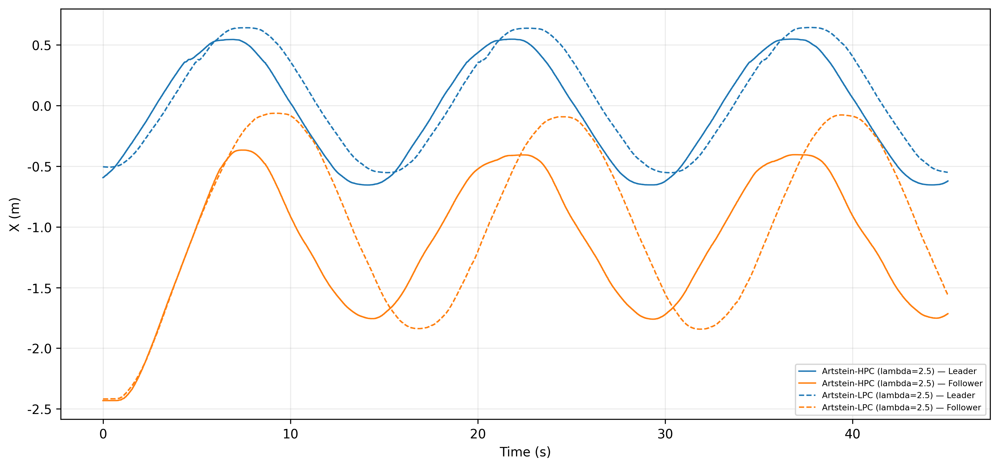
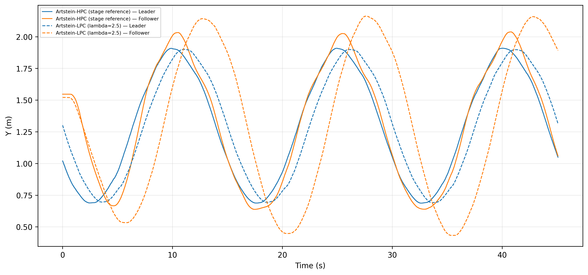

# 双全向移动机器人 Leader–Follower 编队跟踪实物实验报告

## 1. 实验任务说明

本实验在双移动机器人 Leader–Follower 场景中，记录并整理采用 Artstein 输入时滞补偿的齐次比例控制（Artstein-HPC）与线性比例控制（Artstein-LPC）的阶段性实物跟踪结果。

## 2. 实物实验平台

两台全向移动机器人采用动捕状态源。Leader 的轨迹由速度命令驱动，Follower 根据相对编队误差输出速度命令。控制频率为 20 Hz，单次有效记录时长约 45 s。

| 实物全向移动机器人 | 双机器人实物实验场地 |
| --- | --- |
|  |  |
| *图 1　实物全向移动机器人平台* | *图 2　双机器人实物实验场地* |

图 1 展示了实验所使用的全向移动机器人平台，其搭载激光测距、控制与通信等组件。图 2 展示了室内实物实验场地及双机器人布置，后续轨迹和跟踪指标均在该场地条件下采集。

## 3. 数据流与控制方法

实验数据与控制指令按照“动捕状态反馈 → Artstein 纯滞后补偿 → Follower 状态前向预测 → HPC/LPC 控制律 → 速度与轮速约束 → Follower 速度命令”的链路运行。

实物全向移动机器人的控制指令从计算到电机实际响应存在纯滞后，其动态响应采用一阶惯性环节近似描述。若直接依据当前测量状态计算控制量，容易产生跟踪滞后。为此，控制器首先通过 Artstein 变换将历史控制输入纳入扩展状态，消除输入纯滞后对控制律的影响；随后依据电机时间常数 `tau` 对 Follower 状态进行前向预测，估计控制指令实际生效时的运动状态。HPC/LPC 基于该预测状态计算跟踪控制量，再经速度与轮速约束后发送至机器人。

为减小 Leader 速度变化时仅依赖位姿反馈带来的响应滞后，控制器可订阅 Leader 的 `cmd_vel`，提取相邻命令之间的速度增量并经低通处理后叠加到 Follower 的控制输出。当命令数据超时，前馈增量不再参与控制。本实验通过开启和关闭该前馈机制，考察其对实物跟踪误差与响应过程的影响。

## 4. 实验过程与统一条件

四组有效记录均来自实物平台和动捕状态源，并采用统一的轨迹记录方式，保存 Leader 与 Follower 的位置、速度及相对距离等时序数据。每组实验结束后均保存原始轨迹数据和参数快照，作为后续误差统计、图表绘制和对比分析的依据。

实物实验中，Leader 与 Follower 分别运行在 `/robot1` 和 `/robot2` 命名空间下，采用动捕以 120 Hz 提供状态反馈，控制频率设置为 20 Hz。

评价半径固定为 1.0 m，所有统计均以该理想编队半径为唯一评价基准。

控制器的延迟补偿模型中，输入纯滞后取 `Td=0.22 s`，执行器动态响应采用时间常数 `tau=0.43 s` 的一阶惯性环节近似描述，并据此进行 Artstein 补偿和 Follower 状态前向预测。

每次实验前，先完成两台机器人的初始状态设置、动捕状态确认和控制参数检查；在 Leader 按设定轨迹运动、Follower 进入闭环跟踪后，连续记录 45 s 的状态与运动数据。实验结束后停止两台机器人运动，并对采集结果进行完整性检查后用于后续分析。

| 项目 | 实验设置 |
| --- | --- |
| 机器人角色 | 两台全向移动机器人，分别承担 Leader 与 Follower 角色 |
| 状态反馈 | 动捕系统，反馈频率 120 Hz |
| 控制频率 | 20 Hz |
| 单次记录时长 | 约 45 s |
| 期望编队半径 | 1.0 m |
| 输入纯滞后模型参数 | `Td=0.22 s` |
| 执行器响应模型参数 | `tau=0.43 s` |

*表 1　实物 Leader--Follower 跟踪实验的主要条件*

## 5. 实验一：Artstein-HPC 的 Leader 命令速度前馈开/关对比

表 2 汇总了两组约 45 s、Leader 平均速度约 0.246 m/s 的 Artstein-HPC 实物跟踪指标，包括全过程误差和末 10 s 的跟踪误差与波动。

图 1 至图 4 分别从平面轨迹、速度分量以及 X/Y 位置响应展示前馈开启与关闭时的实物跟踪过程。表 2 在相同记录基础上给出距离保持和速度一致性的定量指标，从而同时考察编队几何关系与运动同步性。

*图 3　Artstein-HPC 前馈开关轨迹对比*

*图 4　Artstein-HPC 前馈开关 Vx/Vy 速度对比*

*图 5　Artstein-HPC 前馈开关 X 坐标对比*

*图 6　Artstein-HPC 前馈开关 Y 坐标对比*

表中“平均距离误差”和“末 10 s 距离误差”均为平均绝对距离误差，“距离波动”为距离误差标准差。相对速度误差定义为 Leader 与 Follower 在平面内速度分量之差的模长；数值越小，表示 Follower 的实际运动速度与 Leader 越一致。

| 工况 | 平均距离误差 (m) | RMS 距离误差 (m) | 末 10 s 距离误差 (m) | 末 10 s 距离波动 (m) | 平均相对速度误差 (m/s) | 末 10 s 相对速度误差 (m/s) |
| --- | ---: | ---: | ---: | ---: | ---: | ---: |
| Artstein-HPC，Leader 命令速度前馈开启 | 0.1202 | 0.2791 | 0.0444 | 0.0471 | 0.0856 | 0.0462 |
| Artstein-HPC，Leader 命令速度前馈关闭 | 0.1282 | 0.2895 | 0.0485 | 0.0515 | 0.0921 | 0.0505 |

*表 2　Leader 命令速度前馈开/关的实物跟踪指标对比*

由表 2 可见，开启 Leader 命令速度前馈后，平均绝对距离误差由 0.1282 m 降至 0.1202 m，RMS 距离误差由 0.2895 m 降至 0.2791 m；末 10 s 的平均绝对距离误差和距离误差标准差也分别由 0.0485 m、0.0515 m 降至 0.0444 m、0.0471 m。

总体来看，在本次实物记录中，开启 Leader 命令速度前馈后，Follower 在全过程和跟踪后段均表现出更小的距离偏差、速度偏差与波动。该结果说明前馈机制对 Leader 速度变化具有一定的提前响应作用；但仍需在相同工况下补充重复试验，以进一步验证其稳定性与可重复性。

## 6. 实验二：Artstein-HPC 与 Artstein-LPC 的阶段性结果

表 3 汇总了 Artstein-HPC 实验二参考组与 Artstein-LPC 实物记录；两组均采用 λ初值为 2.5 的设置，用于比较两类控制方法在当前实验条件下的跟踪表现。

λ初值用于设定控制器在初始跟踪阶段的最小线性闭环带宽，影响其对初始编队误差的响应强度与收敛过程。

前期测试中，LPC 在 λ初值为 1.5 的实物工况下发生碰撞，未形成可用于轨迹统计的有效记录；因此本次 HPC/LPC 对比统一采用 λ初值为 2.5。当前结果反映了两类控制方法在该设置下的实物表现，后续仍可通过重复试验进一步验证其稳定性与可重复性。

*图 7　Artstein-HPC 与 Artstein-LPC 阶段性轨迹*

*图 8　Artstein-HPC 与 Artstein-LPC Vx/Vy 速度对比*

*图 9　Artstein-HPC 与 Artstein-LPC X 坐标对比*

*图 10　Artstein-HPC 与 Artstein-LPC Y 坐标对比*

| 工况 | 平均距离误差 (m) | RMS 距离误差 (m) | 末 10 s 距离误差 (m) | 末 10 s 距离波动 (m) | 平均相对速度误差 (m/s) | 末 10 s 相对速度误差 (m/s) |
| --- | ---: | ---: | ---: | ---: | ---: | ---: |
| Artstein-HPC，λ初值=2.5 | 0.1542 | 0.3145 | 0.0509 | 0.0585 | 0.0978 | 0.0674 |
| Artstein-LPC，λ初值=2.5 | 0.4144 | 0.4771 | 0.3411 | 0.3718 | 0.2444 | 0.2478 |

*表 3　Artstein-HPC 与 Artstein-LPC 的阶段性实物跟踪指标*

由表 3 可见，Artstein-HPC 参考组的平均距离误差、末 10 s 距离误差以及相对速度误差均小于当前 λ初值为 2.5 的 LPC 记录。结合图 5 至图 8，HPC 参考组能够较快进入较稳定的跟踪状态；LPC 组虽可完成闭环跟踪，但仍存在较大的距离偏差和速度不一致。由于两组并非严格单变量条件下的重复试验，该结果用于说明当前阶段的实物表现，不作为两类控制律性能优劣的严格结论。
